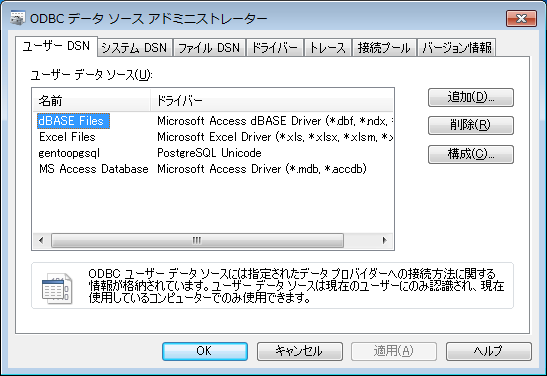

RDBMSにアクセスするためODBCドライバをインストールしたが、データソースを設定すべくコントロールパネル→管理ツール→ODBC を開いてもドライバ一覧に出てこない・・・64bit Windowsを使っているとそういうことが起こる。理由は簡単で、インストールしたODBCドライバが64bit版じゃないから。

そういう時は 32bit版の ODBCアドミニストレータを実行してやると良い。

```
C:¥WINDOWS¥SysWOW64¥odbcad32.exe
```

&nbsp;

これで設定すれば、32bitアプリケーションからODBCデータソースを利用できる。
