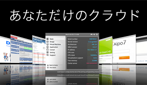

## サーバコンソリデーションとは？

サーバコンソリデーションとは、計算機性能の向上と仮想化技術を利用することにより、複数台のサーバを一台にまとめてしまうことです。処理能力が低く容量の小さい古いサーバを何台も常時稼働させておくより、最新の高速大容量サーバ一台にまとめてしまった方が運用コストを節約できます。

下記に2008年と2017年における一般向けPCのおおまかな性能比較を示します(※)。ここから、5年前の機器なら 3〜4台はひとつにまとめられるであろうことを読み取ることが出来ます。5年よりもっと前の機器あればさらに多くの台数をまとめられますので、結果的に10台以上のサーバをまとめてしまえることも珍しくありません。

※サーバ専用機は一般向けPCと傾向が少し異なるものの、毎年性能がアップすることに変わりはありません。

時代|2008年|2017年
----|----|------
HDD容量|1TB|10TB
CPU能力|2017年の1/10|2008年の10倍
最大メモリ搭載量|8GB|64GB

性能の自然向上もさることながら、サーバの用途によってはそれほどCPUやメモリ、HD容量といった資源を必要とせず余らせていることも多いため、既存のシステムを調査したうえでそのようなサーバについては資源割り当てを減らすことでさらに多くの台数をまとめることも可能です。

## まとめても今まで通り

ネットワーク経由の利用者からは、まとめられたサーバも今までと変わらず複数台のサーバ（仮想サーバ）に見えますので、移行のために利用者の手を煩わせることはありません。

つまり、利用者からは今までのサーバが全て今まで通りに稼働しているように見えます。

## まとめてバックアップ

大切なサーバのバックアップは定期的に取得できているでしょうか？最後に確認したのはいつですか？

対象の台数が多いとついバックアップを取ったり確認したりすることがおろそかになりがちですが、一度コンソリデーションしてしまえば一台のサーバで全ての仮想サーバを一括でバックアップできるためデータ消失の脅威から御社のデータを守りやすくなります。

## 我々にご依頼いただく理由

### 自社OS製品 Walbrix

当社では、自社にてオープンソースの仮想化技術を用いたオペレーティングシステムを開発・維持し、ノウハウを集積しています。特に Linux系OSでのサーバコンソリデーションに必要な P2V（物理→仮想）移行作業については多数の経験を持っています。

また、Walbrixは仮想サーバの停止・再開やシステム全体のシャットダウンなど、日本語でわかりやすい画面から誰でも簡単にできるようになっているほか、月額保守契約により当社よりVPNによる遠隔ログインで保守監視サービスを提供させていただけるようになっています。
